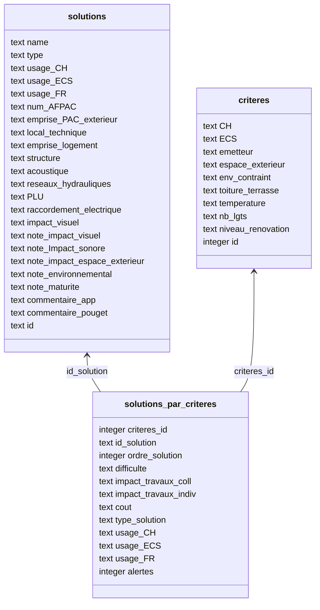

# PACOUPA

**PACOUPA** a pour but d'outiller les copropriétaires dans l'installation de systèmes de chauffage décarbonés adaptés à leur logement.

A partir de quelques questions simples sur l’immeuble, l'outil permet de diriger les copropriétaires vers les solutions les plus pertinentes.

## Installation et lancement local

Mettre à jour le fichier .env avec la variable TURSO_DATABASE_URL="http://127.0.0.1:8080".

```bash
turso dev --db-file assets/pacoupa.db 

yarn install
yarn dev
open http://localhost:3000
```


## Build 

```bash
yarn build
```

---
<a href="https://vercel.com/?utm_source=ademe&utm_campaign=oss" alt="Url Vercel"><image src="https://user-images.githubusercontent.com/37937348/161967395-a5064a6a-b4d3-4ede-a940-ad81fa773916.svg" alt="Vercel" width="100" /></a>


## Persistence

Les données sont stockées dans une DB SQLite hébergée sur Turso.

1. Création de la DB SQLite

Le fichier pacoupa.db peut être reconstruit à partir des fichiers tableurs stockés sur Google Drive.

Ouvrir le fichier `Simulateur 1 - PACOUPA`
- exporter en csv le premier onglet en le nommant solutions_par_criteres.csv
- exporter le second en le nommant solutions.csv

Ouvrir le fichier Simulateur 2 le plus récent. 
- exporter l'onglet Bdd_energie en bdd_energie.csv

Ouvrir le fichier `typologies PACOUPA`.
- exporter l'onglet principal en typologies.csv.

- stocker tous ces fichiers dans le répertoire assets
- lancer le script /scripts/db/build_db.sh 

```shell
./scripts/db/build_db.sh
```


2. Push sur Turso

Il faut auparavant s'authentifier avec `turso auth login`.

```shell
# si besoin de supprimer une base `turso db destroy pacoupa`

# création d'une db suffixée avec le jour d'aujourd'hui
turso db create pacoupa-20240528 --from-file assets/pacoupa.db
```

Pour créer un nouveau token d'accès en lecture seule
```shell
turso db tokens create pacoupa-20240528 -r 
```

Recopier le token dans .env et .env.local (TURSO_DATABASE_URL et TURSO_AUTH_TOKEN).
Il faudra aussi le noter sur Vercel settings.

3. Génération du schéma types Drizzle

D'abord, vérifier que le fichier `.env` renseigne bien les variables TURSO_DATABASE_URL et TURSO_AUTH_TOKEN.

```shell
yarn dk:introspect
```

Cette commande va regénérer le fichier schema.ts et les types Drizzle.

Modifier le fichier drizzle/schema.ts pour améliorer le typage des objets de persistence: 
- pour solutions.type, ajouter `drizzleEnumTypes` (ex: `type: text("type", drizzleEnumTypes).notNull()`)
- ajouter `drizzleEnumUsages` pour 
    - solutions.usageCh
    - solutions.usageEcs
    - solutions.usageFr
- ajouter `drizzlEnumNotes` pour
    - solutions.noteImpactSonore
    - solutions.noteImpactEspaceExterieur
    - solutions.noteEnvironnemental
    - solutions.noteMaturite
- ajouter `drizzleEnumNotes` pour
    - solutionsParCriteres.noteDifficulte
    - solutionsParCriteres.noteImpactTravauxColl
    - solutionsParCriteres.noteImpactTravauxIndiv
    - solutionsParCriteres.noteCout

Vous pouvez lancer la compilation typescript pour vérifier que le code est resté typesafe.

```shell
yarn tsc
```

### FAQ

*J'ai modifié la DB sur Turso et j'ai une erreur de déploiement sur Vercel?*

Cela peut être dû au token d'accès qui a changé. 
Regénérer le token et le mettre à jour sur Vercel.


### Schéma DB





## Déploiement

Le produit est déployé sur Vercel.

| PACOUPA_ENV | Terminologie Vercel | Branche Git | Fonction | URL |
| --- | --- | --- | --- | --- |
| prod | Production | main | Site de production | https://pacoupa.ademe.fr/ |
| preprod | Preview | dev | Site de préproduction | https://pacoupa.ademe.vercel.app/ |
| dev (défaut) | Development | (feature branch) | Recette par PR |  |
